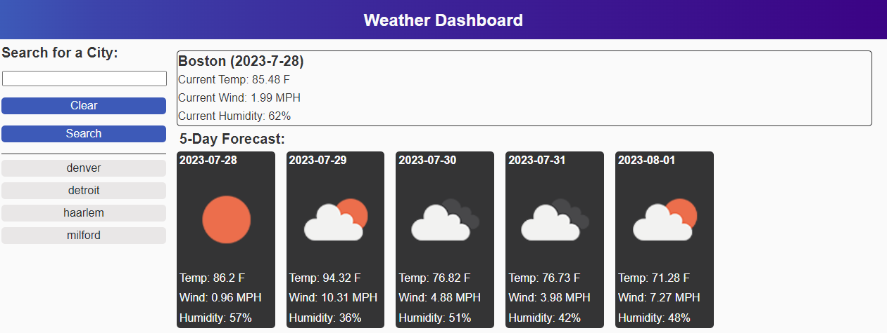

# 5-day-weather

## Description
This website was created Florian Kreuk as part of the UCONN Coding Bootcamp module 4. The purpose of this website is to generate a five day weather forecast utilizing the [openweathermap API](https://openweathermap.org/forecast5). The website will store the user's city searches in local storage and permit the user to revisit the prior city searches by selecting them.

The following image demonstrates the web application's appearence:

Below is the landing page:

The following link takes you to the deployed application: [link](https://f-kreuk.github.io/5-day-weather/)

## Installation
N/A

## Usage
To use this website, simply search for a city in the search box and select "Search". This will add the search to local storage, add an li component to display your prior search, and update the current/5-day weather fields utilizing the openweathermap API data. To clear prior searches, simply select the "Clear" button. 

## Credits
For the css reset, I utilized the sample provided in 28-Stu_Mini-Project through the UCONN coding bootcamp.

I utilized the following YouTube tutorial as a guide to local storage:
https://www.youtube.com/watch?v=2hJ1rTANVnk

I utilized the following stackoverflow tutorial to find the length of the local storage for a specific key: 
https://stackoverflow.com/questions/37544230/how-to-get-total-count-of-a-particular-key-in-local-storage

I utilized the following tutorial to leverage jQuery to get the value from clicking a specific li element:
https://codepedia.info/click-event-for-dynamic-button-jquery

Lastly, I utilized the following APIs available through openweathermap.org.
For current weather: https://openweathermap.org/current
For 5-day forecast: https://openweathermap.org/forecast5

## License
Please refer to the LICENSE in repo.